# Project Work Optimization Techniques for Machine Learning 

University project, implementation in Python of three optimization algorithms: SGD, SGD-M, and SAG. Comparison and analysis of the results in terms of Accuracy, execution time, and convergence rate.

All dataset used are available here : https://www.csie.ntu.edu.tw/~cjlin/libsvmtools/datasets/binary.html

A project report in Italian is available here: https://www.overleaf.com/read/qcwpphbxwptp#7ed7bc

# Results:

<h4>Dataset: German-Numer </ha>

<table>
 <tr>
    <td>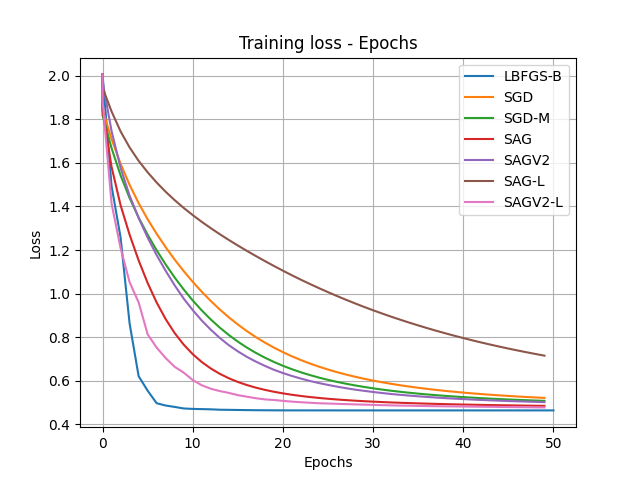</td>
    <td></td>
 </tr>
</table>

<h4>Dataset: Australian </ha>

<table>
 <tr>
    <td>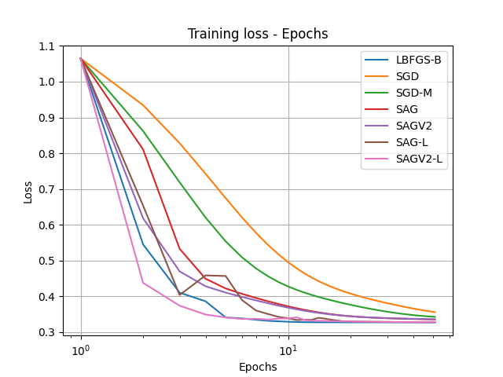</td>
    <td>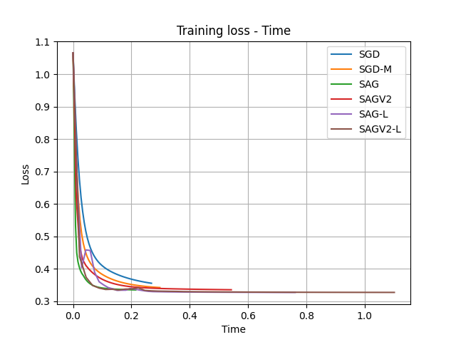</td>
 </tr>
</table>

<h4>Dataset: a5a </ha>

<table>
 <tr>
    <td>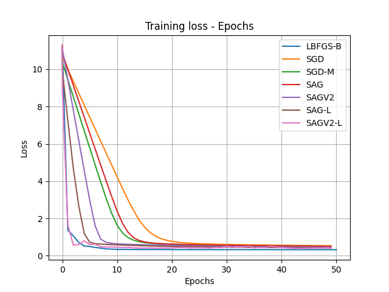</td>
    <td>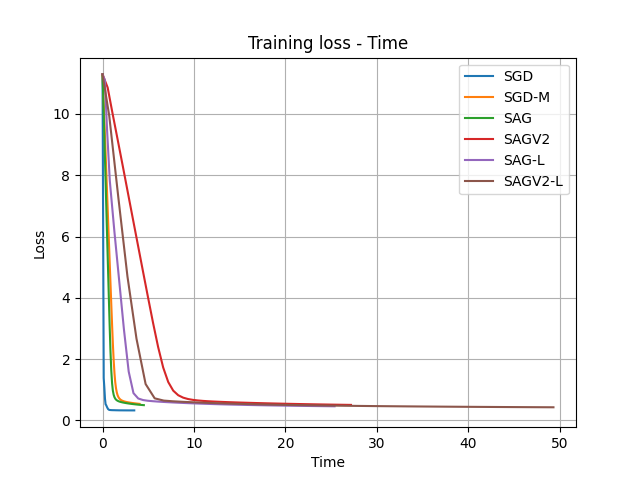</td>
 </tr>
</table>

<h4>Dataset: a6a </ha>

<table>
 <tr>
    <td>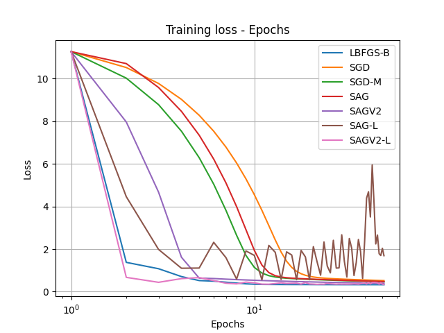</td>
    <td>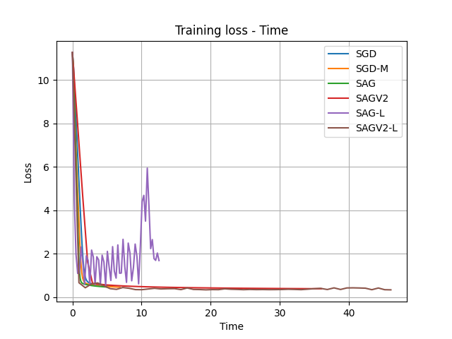</td>
 </tr>
</table>

<h4>Dataset: a7a </ha>

<table>
 <tr>
    <td>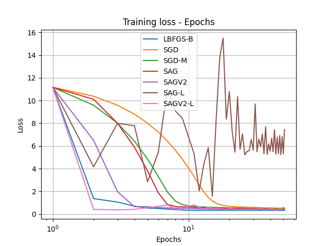</td>
    <td>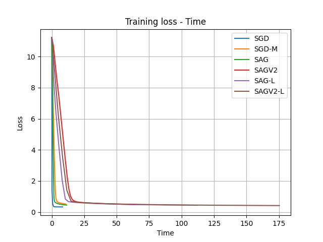</td>
 </tr>
</table>

<h4>Dataset: a8a </ha>

<table>
 <tr>
    <td>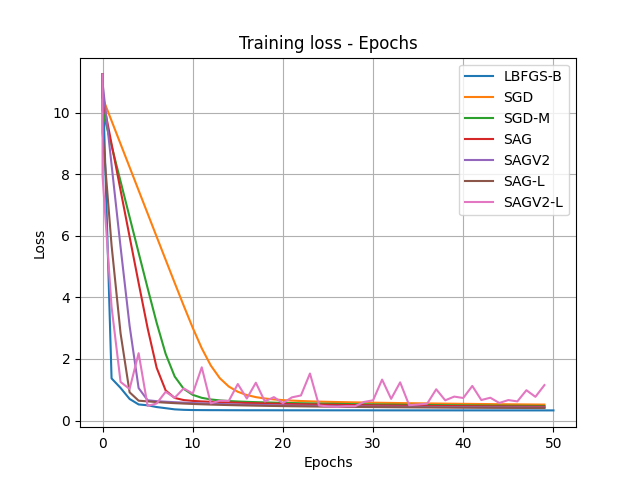</td>
    <td>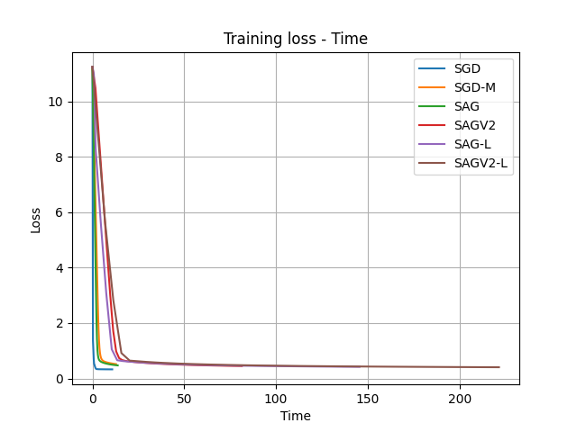</td>
 </tr>
</table>

<h4>Dataset: ijcnn1 </ha>

<table>
 <tr>
    <td>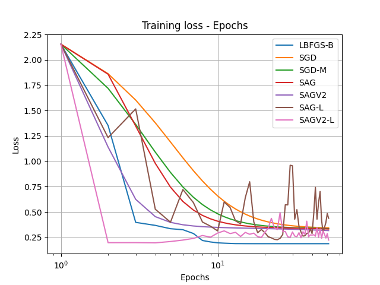</td>
    <td>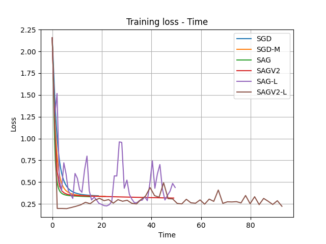</td>
 </tr>
</table>

<h4>Dataset: phishing </ha>

<table>
 <tr>
    <td>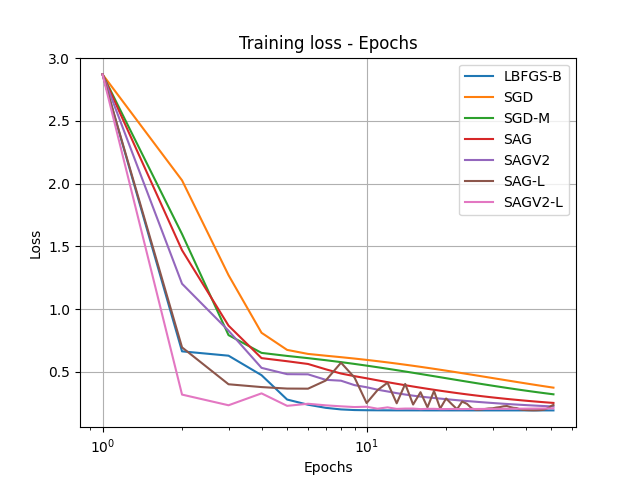</td>
    <td>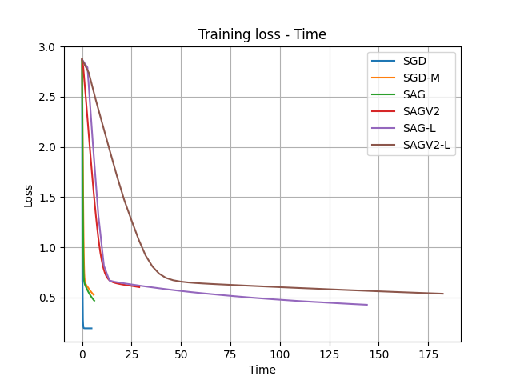</td>
 </tr>
</table>
